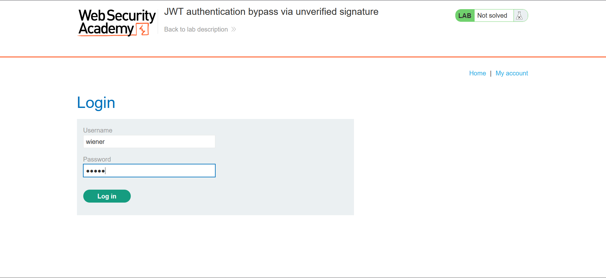
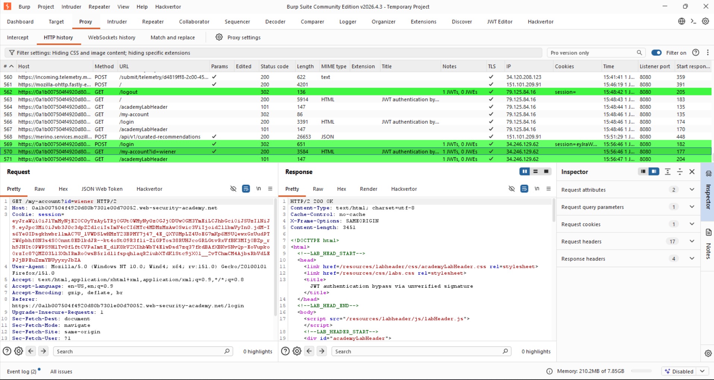
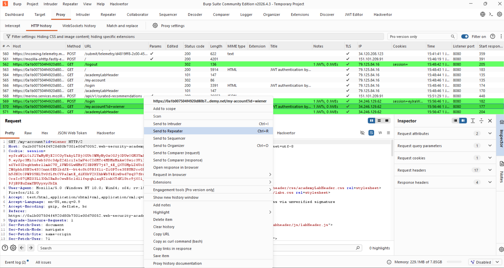
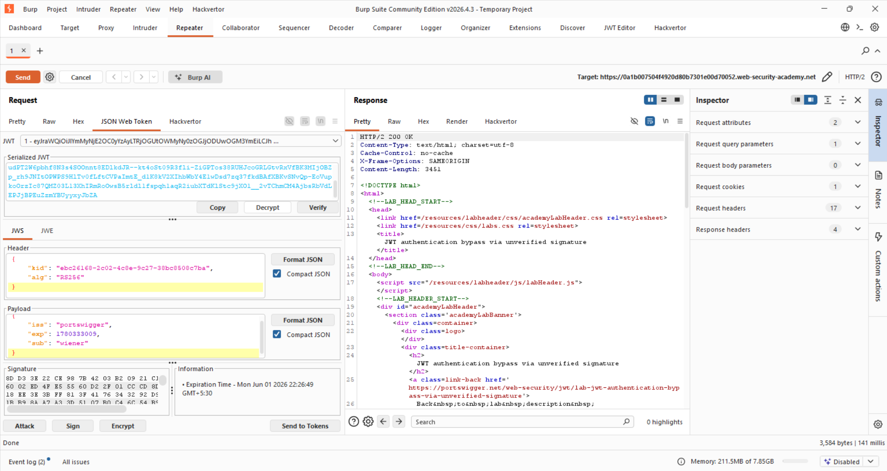
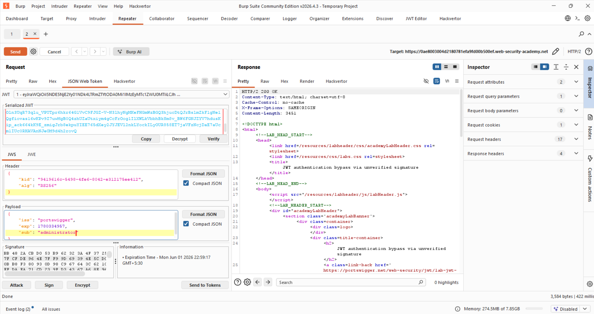
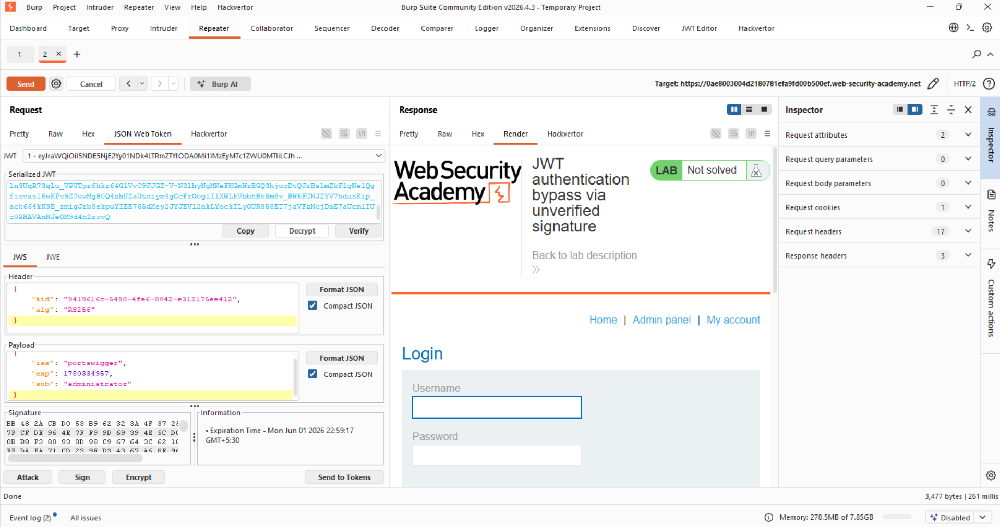

Title:JWT authentication bypass via unverified signature
Goal:gain access to the admin panel at /admin, then delete the user carlos. 

for labs i have installed the JWT editor extension on burpsuite.(you can also use jwt_tool).

Initial steps  for solving any JWT lab:-
1>login into your accout with the given credentials.

2>open BURP proxy and go to the http history tab and you will see the jwt highlighted in green(If you can't see it then click on
my-accout in the lab browser  again and you can)

3>send it to the repeater.and go to the json web tokens tab,where you can see your token and its decoded version and you can inject and perform your attacks.

NOW as we have seen how to get JWT to the repeater.We can sart with the experiment.

it is mentioned in the title that the jwt doesn't verify signature it means that we can change the Payload part of the jwt where the sub="wiener" to "administrator". and click send and get the admin panel.

