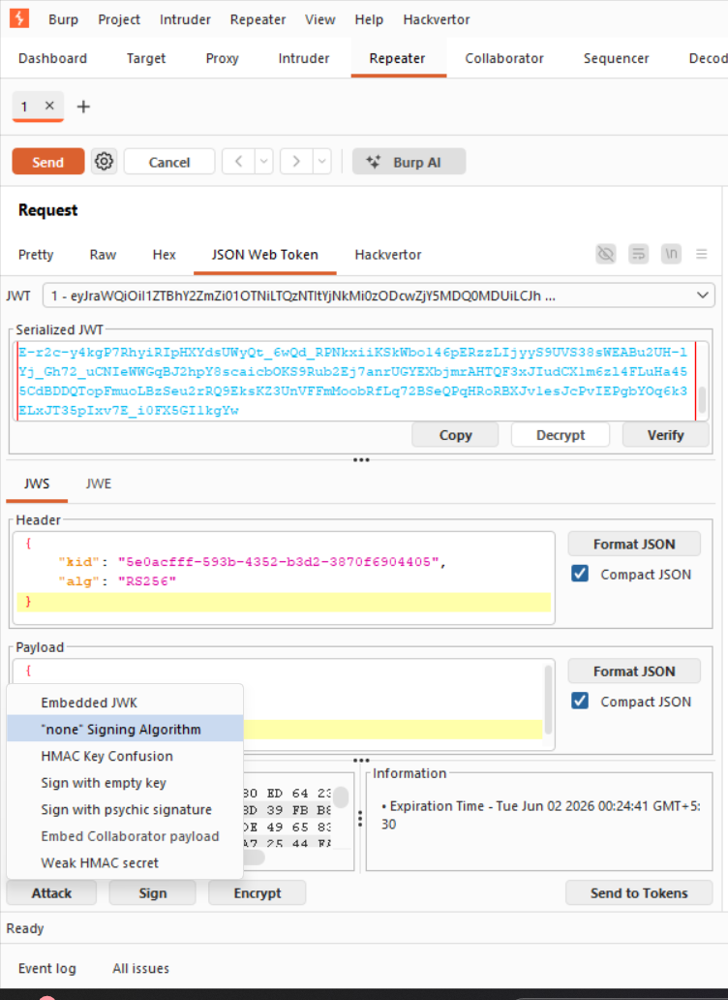
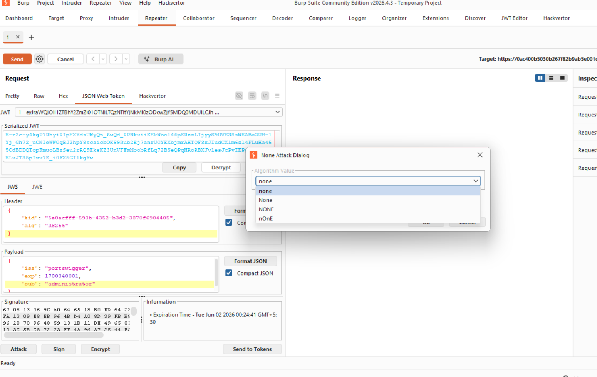
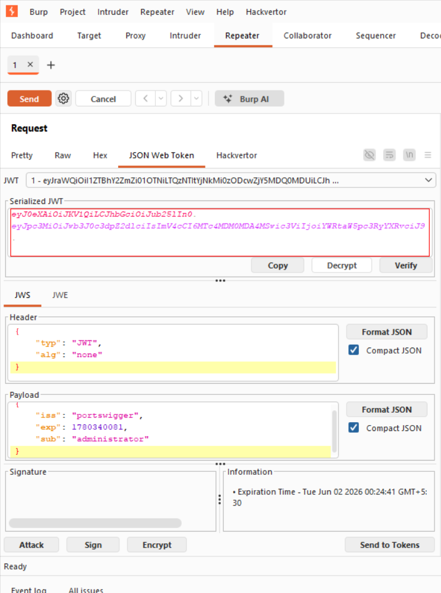
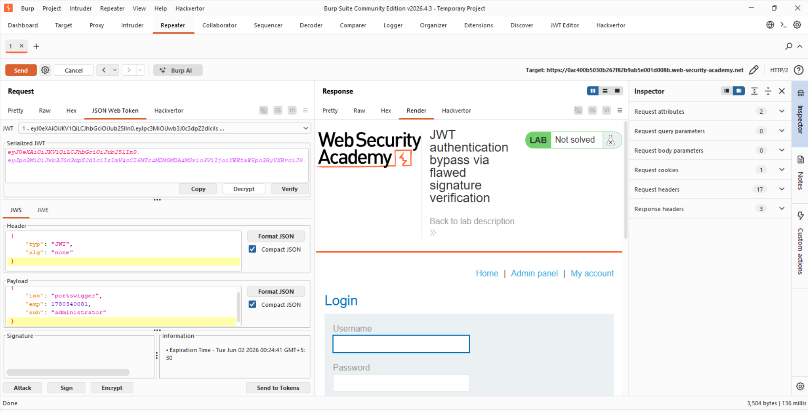

Title:JWT authentication bypass via flawed signature verification

Objective:gain access to the admin panel at /admin, then delete the user carlos. 

As mentioned in the Lab-1 we will use the same initial steps:https://github.com/shouryanagaraju7-collab/JWT-Portswigger-Lab-writeups/blob/main/Lab1/Lab-1.md 

here we are exploiting the fact that in the header of jwt there is a parameter alg: which tells the server which algorithm to use to verify the signature.so it is inherently flawed so we just change the alg: "none" but the server has some filter which we have to bypass for which we use distinct capitalization to bypass it.

so after we have our token in the repeater we will change "wiener" to "administrator" then click the attack button and then click on the alg:none attack .then we will try each off the payloads.

when we have given the payload none we got the 102 message which we followed redirection then go the 200ok message and we got our admin panel.

then we will copy the sessiona and paste it in the web inspector and refresh and we will be able to see the admin panel and the delete user carlos to complete the lab

