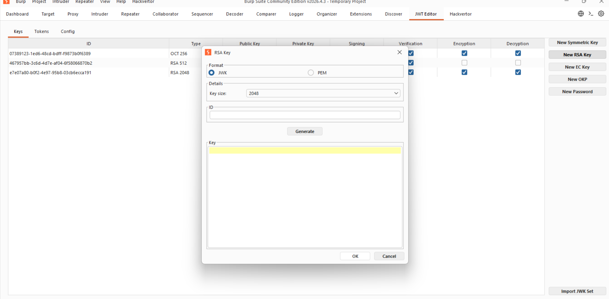
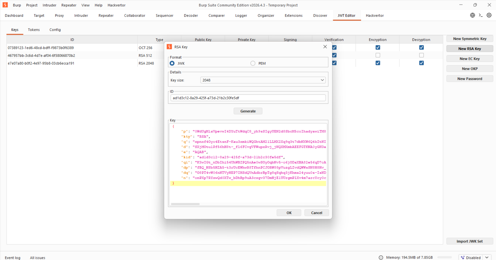
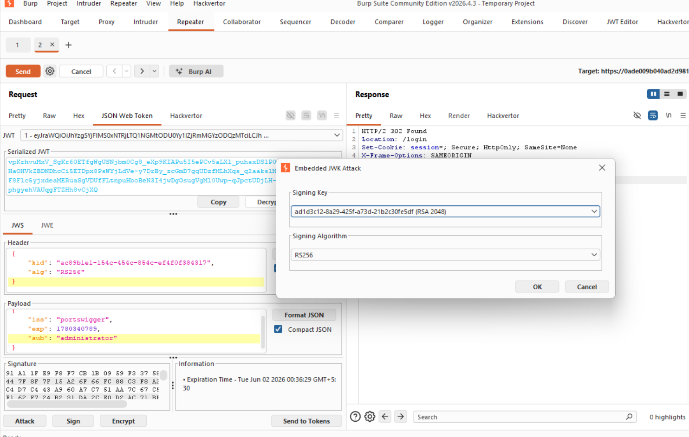
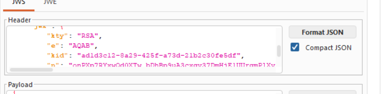
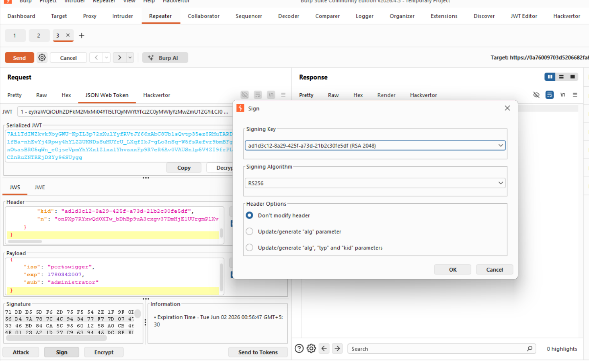
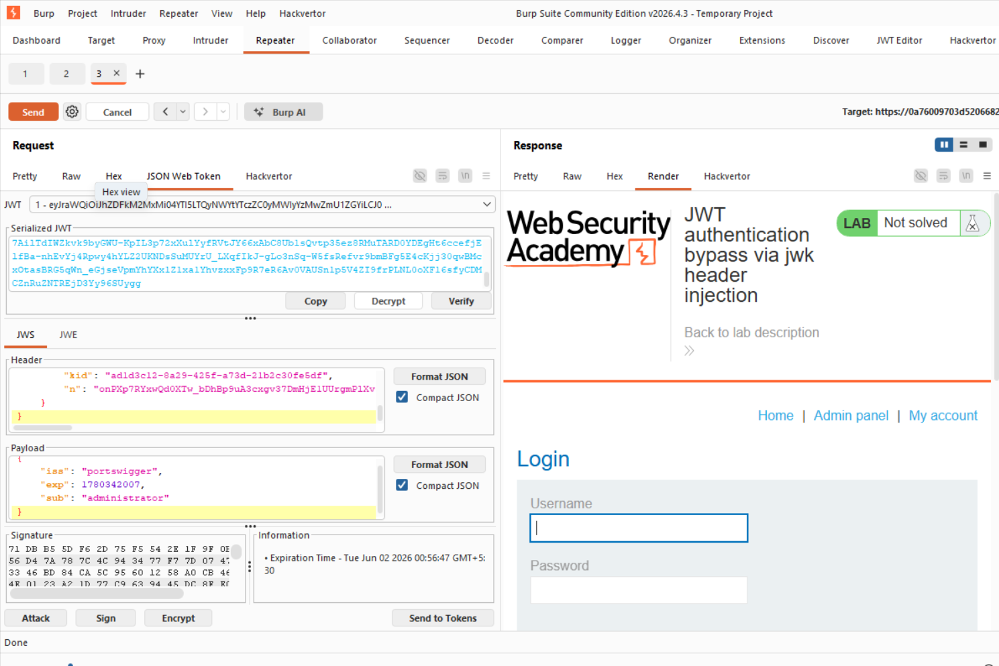
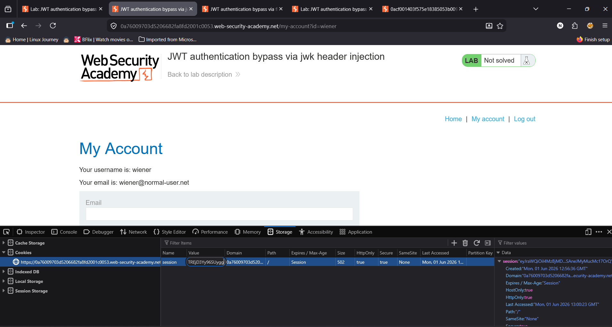
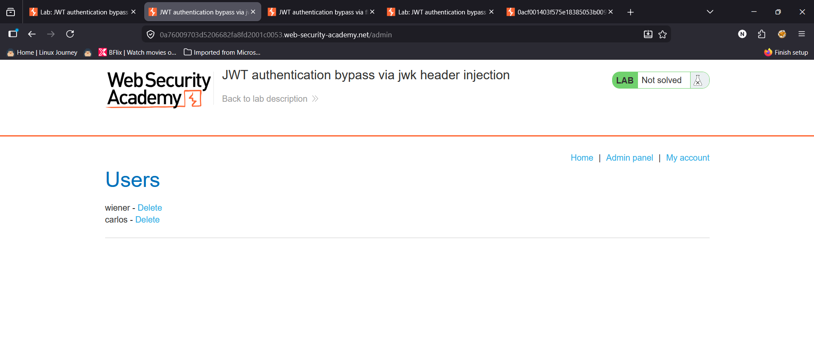

Tiltle:JWT authentication bypass via jwk header injection

objective:gain access to the admin panel at /admin, then delete the user carlos. 

As mentioned in the Lab-1 we will use the same initial steps:https://github.com/shouryanagaraju7-collab/JWT-Portswigger-Lab-writeups/blob/main/Lab1/Lab-1.md 

after you have the jwt in the repeater we will first generate rsa key by going to the jwt editor tab.

then go to the jwt web tokens tab in repeater and change "wiener" to "administrator" then click attack and select embedded jwk
and then select the key you have generated.

after that you can see that the header has changed and we have sucessfully injected our jwk then we will sign it with the generated key.

and then send the payload you will be able to see the admin panel in the response.

now we will copy the cookie session and pate it to the web inspector and delete the user carlos to complete the lab

