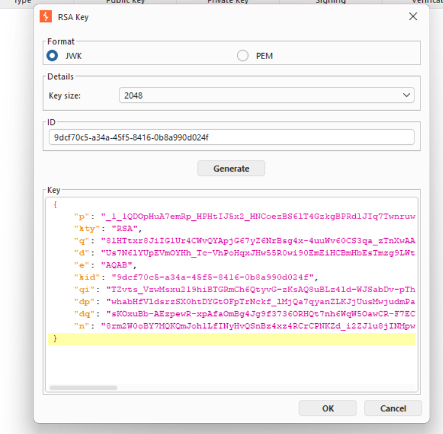
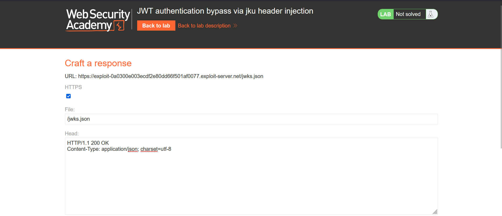
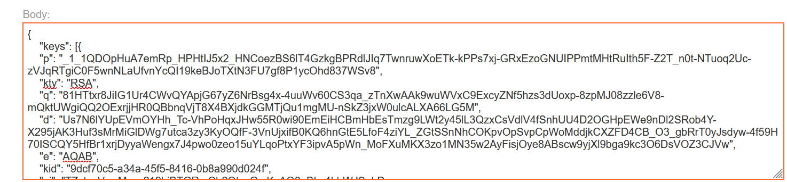
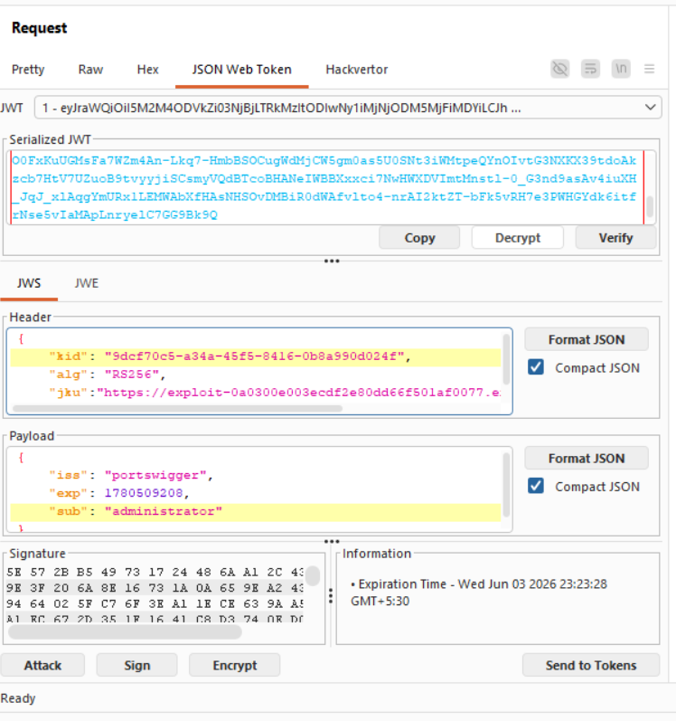
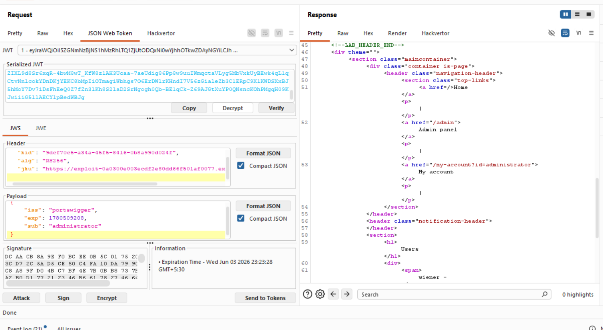
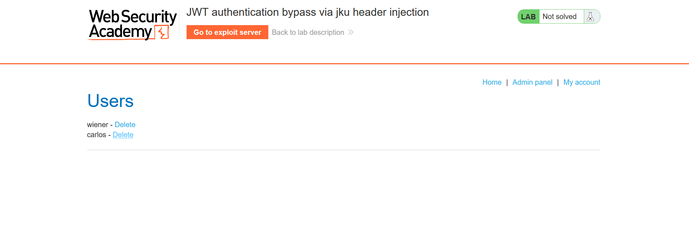

Tiltle:JWT authentication bypass via jku header injection

objective:gain access to the admin panel at /admin, then delete the user carlos. 

As mentioned in the Lab-1 we will use the same initial steps:https://github.com/shouryanagaraju7-collab/JWT-Portswigger-Lab-writeups/blob/main/Lab1/Lab-1.md 

we will first create a new RSA key .

then we will  go to the exploit server and do the following changes:-

change the content-type to application/jason
url endpoint to jwks.json

and then write this in the body:-

we have pasted he genrated rsa key in the key array

and then save the payload.

and then add the jku parameter in the header and then add the url of the exploit server in it .and then change the kid to the kid of the generated RSA key. 

after that sign with the key generated.

and the send it to see the admin panel.

then paste teh cookie session in he web inspector and then delete carlos to complete the lab.

