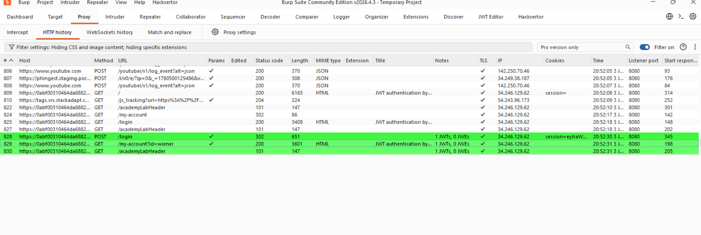
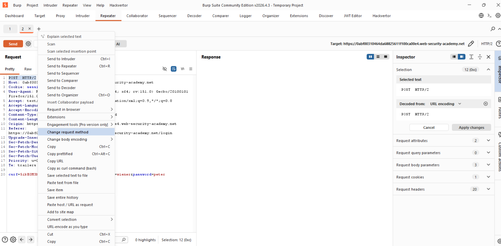
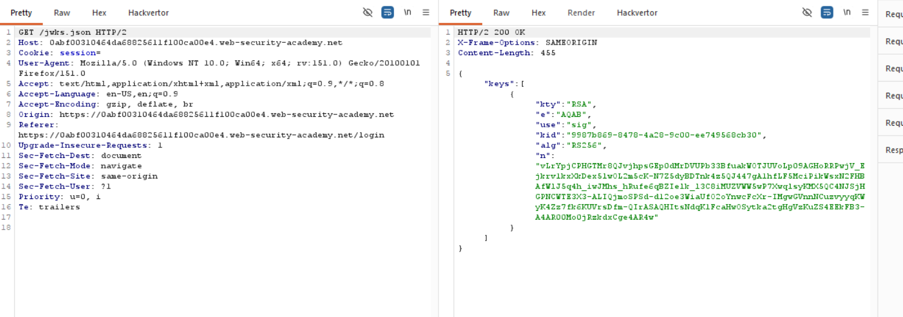
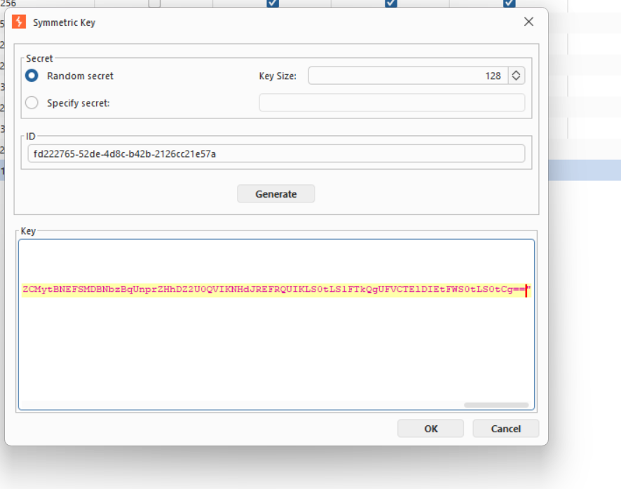
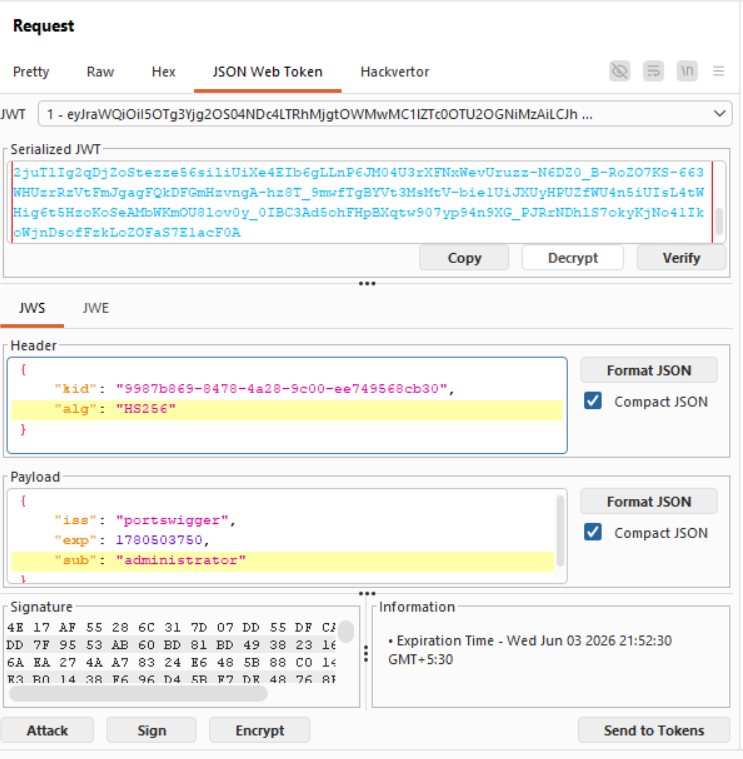
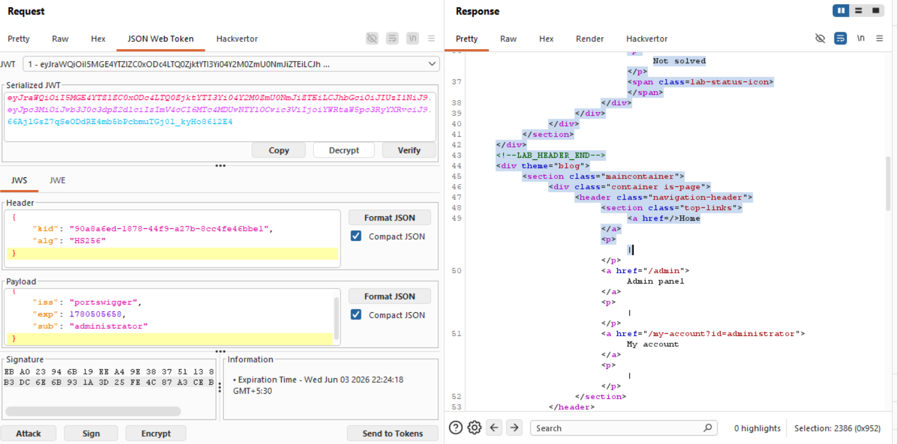
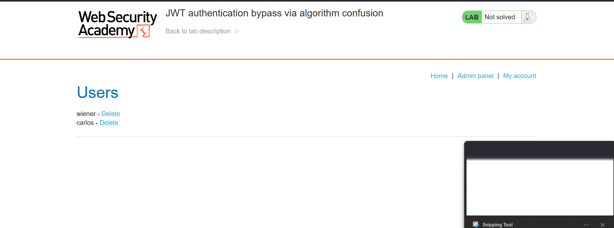

Tiltle:JWT authentication bypass via algorithm confusion

objective:to sign a modified session token that gives you access to the admin panel at /admin, then delete the user carlos. 

As mentioned in the Lab-1 we will use the same initial steps:https://github.com/shouryanagaraju7-collab/JWT-Portswigger-Lab-writeups/blob/main/Lab1/Lab-1.md 

now as mentioned in teh portswigger academy we will get the public key from the sever.it is given that it can be at  /jwks.json or /.well-known/jwks.json.so we will try that ->

i have gotten a POST request and then i am changing it to GET and trying the paths for public key,

and we will copy the key and convert it into PEM using jwt editor extension.

then we will base64 encode the PEM 

then go back to the JWT Editor Keys tab and create New Symmetric Key. and change the value of K to the PEM that you created.

now go to the jwt we got from our login and then change wiener to administrator and change the alg to HS256 

ow sign with your new HS256 key you should be able to get the admin panel 

then copy the cookie paste i web inspector and then delete carlos

