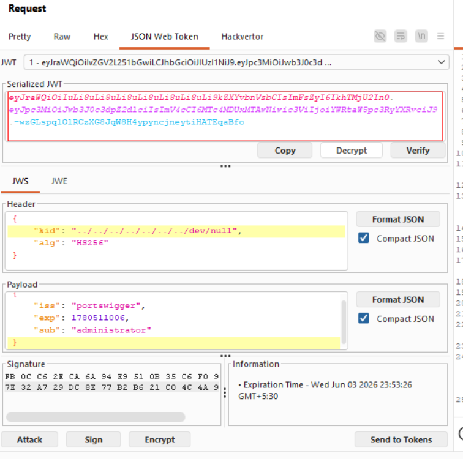
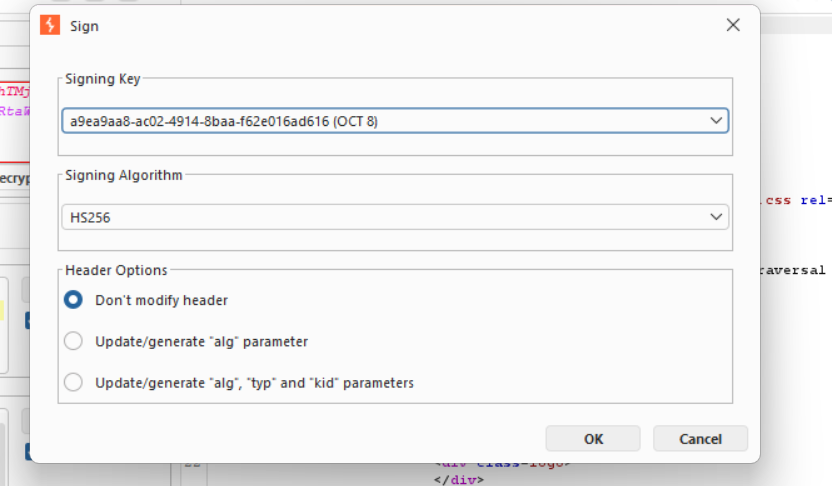
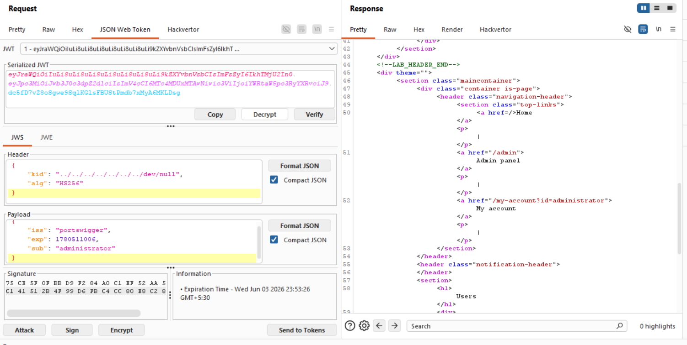
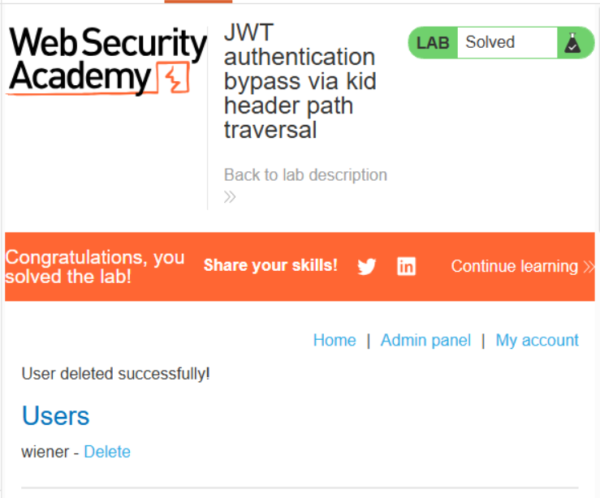

Tiltle:JWT authentication bypass via kid header path traversal

objective:to sign a modified session token that gives you access to the admin panel at /admin, then delete the user carlos. 

As mentioned in the Lab-1 we will use the same initial steps:https://github.com/shouryanagaraju7-collab/JWT-Portswigger-Lab-writeups/blob/main/Lab1/Lab-1.md 

the main motive of this lab is that we  have to use path traversal methods like(../../../dev/null) in the kid parameter and then sign the jwt by a symmetric key with k value base64 encode null byte (AA==).

generate a new symmetric key and change the vallue of k to AA==.

then do these changes to the jwt .

and then sign it with the symmetric key that we generated.

and then click send then you will be able to see the admin panel .

after that delete the user carlos by /admin/delete?username=carolos to complete tha lab.

